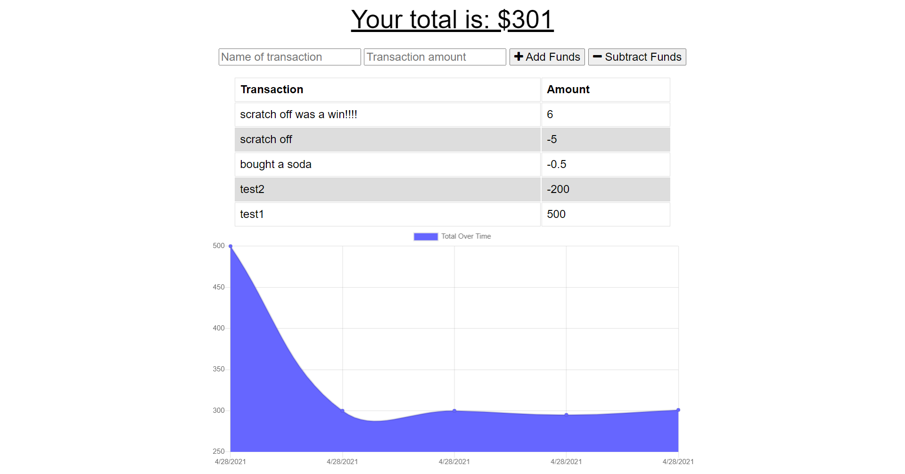

# Budget-Tracker

## Description

I don't get any cell service at my local grocery story but it'd still be nice to be able to track my spending, therefore a budget app that keeps track of user input while offline and fills in the gaps when a connection is re-created would be extremely useful. Combining the built in indexeddb api with a web manifest and service worker allows the application to function correctly after only loading online once.

## Table of Contents

- [Installation](#installation)
- [Usage](#usage)
- [Credits](#credits)
- [License](#license)

## Installation

[Live deployment here!](https://serene-inlet-38611.herokuapp.com/)

## Usage

Simply name your transaction, enter the amount, and select whether it is a credit or debit before submitting. Application automatically turns data into a graph and saves inputs while offline.

    :

## Credits

The class activities helped a lot!

## License

Copyright 2021 Sean Kelly

Permission is hereby granted, free of charge, to any person obtaining a copy of this software and associated documentation files (the "Software"), to deal in the Software without restriction, including without limitation the rights to use, copy, modify, merge, publish, distribute, sublicense, and/or sell copies of the Software, and to permit persons to whom the Software is furnished to do so, subject to the following conditions:

The above copyright notice and this permission notice shall be included in all copies or substantial portions of the Software.

THE SOFTWARE IS PROVIDED "AS IS", WITHOUT WARRANTY OF ANY KIND, EXPRESS OR IMPLIED, INCLUDING BUT NOT LIMITED TO THE WARRANTIES OF MERCHANTABILITY, FITNESS FOR A PARTICULAR PURPOSE AND NONINFRINGEMENT. IN NO EVENT SHALL THE AUTHORS OR COPYRIGHT HOLDERS BE LIABLE FOR ANY CLAIM, DAMAGES OR OTHER LIABILITY, WHETHER IN AN ACTION OF CONTRACT, TORT OR OTHERWISE, ARISING FROM, OUT OF OR IN CONNECTION WITH THE SOFTWARE OR THE USE OR OTHER DEALINGS IN THE SOFTWARE.

## Badges

